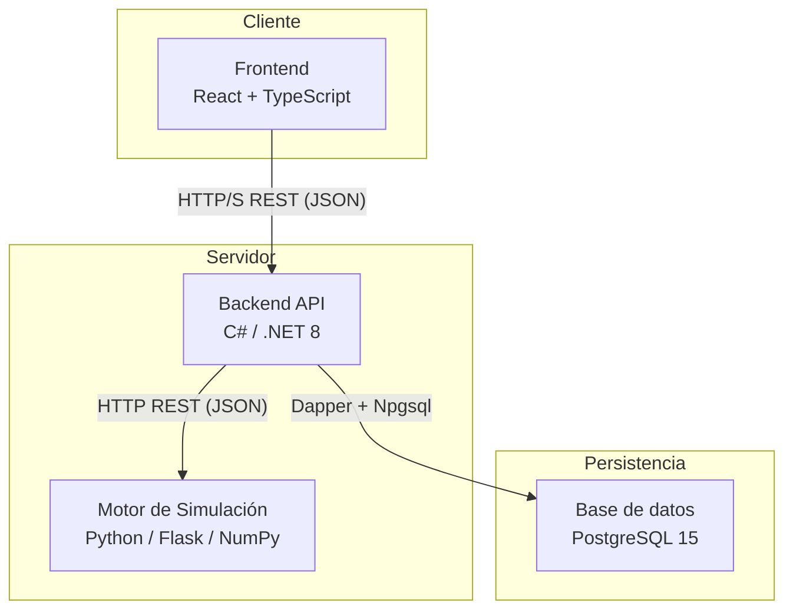

# Simulador de estrategias de inversión

**Proyecto Final — Ingeniería en Informática — FACET — UNT**  
**Autora:** Sofía Rodríguez del Busto  
**Tutor:** Daniel Horacio Melucci

Aplicación web que permite simular y comparar carteras de inversión bajo múltiples escenarios económicos, utilizando el método de Monte Carlo y modelos probabilísticos para cuantificar el impacto del riesgo en la evolución del patrimonio.

---

## Índice

1. [Descripción general](#1-descripción-general)
2. [Arquitectura del sistema](#2-arquitectura-del-sistema)
3. [Stack tecnológico](#3-stack-tecnológico)
4. [Estado de implementación](#4-estado-de-implementación)
5. [Configuración del entorno de desarrollo](#5-configuración-del-entorno-de-desarrollo)
6. [Documentación de decisiones de diseño](#6-documentación-de-decisiones-de-diseño)
7. [Manual de usuario](#7-manual-de-usuario)

---

## 1. Descripción general

El simulador permite al usuario:

- Crear portfolios de inversión compuestos por **acciones** (mercado estadounidense), **bonos**, **letras del Tesoro** y **plazos fijos** (mercado argentino).
- Asociar cada portfolio a un **perfil de riesgo** (conservador, moderado o agresivo).
- Ejecutar simulaciones **Monte Carlo estratificadas** por escenario económico (favorable, moderado, desfavorable), generando 3.000 trayectorias posibles del valor del portfolio a lo largo del tiempo.
- Visualizar la evolución del patrimonio y la inflación acumulada por escenario, con métricas de dispersión (p25/mediana/p75) y probabilidad de pérdida nominal y real.
- Consultar simulaciones pasadas sin re-ejecutar el motor, gracias a la persistencia de estadísticas en base de datos.

---

## 2. Arquitectura del sistema



| Componente | Responsabilidad |
|---|---|
| **Frontend** | Presentar la interfaz al usuario: formularios de portfolio, gráficos de trayectorias e inflación, historial de simulaciones. |
| **Backend API** | Gestionar usuarios, portfolios e instrumentos; invocar el motor; persistir resultados en base de datos. |
| **Motor de simulación** | Ejecutar el cálculo numérico: Monte Carlo, GBM para acciones, DCF para bonos, modelos de renta fija indexada. |

El motor corre como microservicio HTTP independiente (`localhost:5050` en desarrollo, [`https://proyectofinal-simuladorfinanciero.onrender.com`](https://proyectofinal-simuladorfinanciero.onrender.com) en producción). Python fue la tecnología elegida para el motor por preferencia personal y por su relevancia en el área de finanzas cuantitativas y ciencia de datos; un estudio de performance posterior validó que esa elección no compromete el rendimiento: Python (NumPy + numexpr) resultó más rápido que una implementación equivalente en C# en la mayoría de los escenarios medidos, y el mecanismo HTTP reduce el overhead de integración a milisegundos frente al costo de relanzar un proceso por request. El estudio completo se encuentra en [`estudio-pilotos/INFORME_BENCHMARKS.md`](estudio-pilotos/INFORME_BENCHMARKS.md).

El backend queda publicado en [`https://proyectofinal-simuladorfinanciero-1.onrender.com`](https://proyectofinal-simuladorfinanciero-1.onrender.com) y el frontend en [`https://proyectofinal-investlab.vercel.app`](https://proyectofinal-investlab.vercel.app).

---

## 3. Stack tecnológico

| Componente | Tecnología | Justificación |
|---|---|---|
| Frontend | React 18 + TypeScript + Vite | Componentes reutilizables para gráficos; tipado estático para datos financieros; Vite reemplaza CRA discontinuado. |
| Backend API | C# / .NET 8 + ASP.NET Core + Dapper | Plataforma madura para APIs REST; tipado fuerte; Dapper como micro-ORM sobre Npgsql, manteniendo `01_schema.sql` como única fuente de verdad del schema. |
| Motor de simulación | Python 3 + Flask + NumPy | Elegido por preferencia y relevancia en finanzas cuantitativas/ciencia de datos. Flask agrega overhead mínimo para dos endpoints. |
| Base de datos | PostgreSQL 15 | ACID, soporte JSONB para persistir arrays de estadísticas de largo variable, schema dedicado `simulador_financiero`. |

---

## 4. Estado de implementación

| Componente | Estado | Detalle |
|---|---|---|
| Motor de simulación | Completo | Todos los instrumentos implementados y testeados (66 tests en verde). Endpoint `POST /simular` activo. |
| Esquema de base de datos | Completo | Schema PostgreSQL diseñado y revisado (`db/01_schema.sql`). |
| Backend API | Completo | Autenticación JWT, catálogos de referencia e instrumentos, job de refresco automático, CRUD de portfolios y tenencias, integración con el motor, persistencia y lectura de resultados. Tests unitarios en verde. |
| Frontend | Pendiente | — |

### Instrumentos implementados en el motor

| Instrumento | Modelo | Estocástico |
|---|---|---|
| Plazo fijo tradicional | Capitalización compuesta (TNA mensual) | No |
| Plazo fijo UVA | Capital ajustado por CER + tasa real | Sí (inflación T-2) |
| Letra LECAP | Cupón cero, interés simple | No |
| Letra LECER | Cupón cero + ajuste CER | Sí (inflación T-2) |
| Bono tasa fija | DCF sobre flujos nominales fijos | No |
| Bono indexado CER | DCF real convertido a nominal vía CER | Sí (inflación T-2) |
| Acciones | GBM con correlación de factor único (S&P 500) | Sí |

---

## 5. Configuración del entorno de desarrollo

### Requisitos previos

- .NET 8 SDK
- Python 3.11+
- PostgreSQL 15
- Node.js 20+ (para el frontend, cuando corresponda)

### Base de datos

Ejecutar el schema contra la base de datos local:

```powershell
psql -U postgres -f db/01_schema.sql
```

### Motor de simulación (Python)

```powershell
cd motor-simulacion
python -m venv .venv
.venv\Scripts\Activate.ps1
pip install -r requirements-dev.txt
python run.py          # corre en http://localhost:5050
```

### Backend API (.NET)

El backend usa **User Secrets** para las credenciales locales. Nunca se commitean al repositorio.

```powershell
cd backend/SimuladorFinanciero.Api

# Configurar credenciales locales (ejecutar una sola vez)
dotnet user-secrets set "ConnectionStrings:Postgres" "Host=localhost;Port=5432;Database=simulador_financiero;Username=postgres;Password=TU_CONTRASEÑA;Search Path=simulador_financiero"
dotnet user-secrets set "Jwt:Key" "una-clave-secreta-de-al-menos-32-caracteres"

# Levantar la API
dotnet run             # corre en http://localhost:5000
```

Swagger queda disponible en `http://localhost:5000` al iniciar la API.

Para verificar que la API y la base de datos responden:

```
GET http://localhost:5000/health
→ { "estado": "ok", "db": "ok" }
```

---

## 6. Documentación de decisiones de diseño

Las decisiones técnicas, matemáticas y de arquitectura tomadas durante el desarrollo se encuentran en la carpeta [`docs/`](docs/):

| Documento | Contenido |
|---|---|
| [docs/01-modelos-financieros.md](docs/01-modelos-financieros.md) | Modelo matemático de cada instrumento, corrección de Itô, rezago T-2 del CER/UVA, precio de mercado secundario (no licitación primaria) y flujos del backend. |
| [docs/02-orquestador-montecarlo.md](docs/02-orquestador-montecarlo.md) | Diseño del motor: escenarios, pre-generación de aleatoriedad, modelo de correlaciones, vectorización (5× speedup), separación ARS/USD, estadísticas p25/mediana/p75. |
| [docs/03-base-datos.md](docs/03-base-datos.md) | Decisiones del schema PostgreSQL: tipos de datos, persistencia de estadísticas en JSONB, snapshot de escenarios e instrumentos, restricción de perfiles de riesgo, valores seed de escenarios económicos. |
| [docs/04-apis-datos-mercado.md](docs/04-apis-datos-mercado.md) | APIs externas: BYMA Open Data (letras), Docta Capital (bonos soberanos), Alpha Vantage (acciones USA y S&P 500). Endpoints, campos y derivación de parámetros del motor. |
| [docs/05-backend-arquitectura.md](docs/05-backend-arquitectura.md) | Arquitectura del backend .NET: selección de Dapper sobre EF Core, estructura de carpetas, lifetimes de DI, convenciones, manejo de errores, autenticación JWT y roles, Swagger, CORS. |
| [docs/06-endpoints-api.md](docs/06-endpoints-api.md) | Referencia completa de todos los endpoints REST: auth, referencia, instrumentos, administración, portfolios, simulaciones. Request/response y errores por endpoint. |
| [docs/07-portfolio-reglas-negocio.md](docs/07-portfolio-reglas-negocio.md) | Modelo de dominio del portfolio: composición vs corridas, unicidad de instrumentos, restricciones del perfil de riesgo, ownership, reglas de re-simulación, ciclo de vida. |
| [docs/08-integracion-motor.md](docs/08-integracion-motor.md) | Flujo completo de POST /simular: construcción del payload por tipo de instrumento, semilla, validaciones, métricas agregadas y persistencia transaccional. |
| [docs/09-staleness-mercado.md](docs/09-staleness-mercado.md) | Datos de mercado desactualizados al simular: snapshot de tasa/GBM en la tenencia, decisión global de portfolio vía Vista Comparativa, y el mecanismo aparte para el tipo de cambio. |
| [docs/10-plazo-fijo-vencido.md](docs/10-plazo-fijo-vencido.md) | Un plazo fijo vencido bloquea la simulación con 422; el usuario puede eliminarlo o renovarlo desde el detalle del portfolio. Incluye el fix de cálculo de interés devengado. |

---

## 7. Manual de usuario

Guía orientada al usuario final de InvestLab: primeros pasos, alta y gestión de portfolios, instrumentos disponibles explicados en lenguaje llano, cómo ejecutar una simulación e interpretar sus resultados, historial, casos especiales y glosario. Incluye capturas reales de la aplicación.

[docs/MANUAL_USUARIO.md](MANUAL_USUARIO.md)
