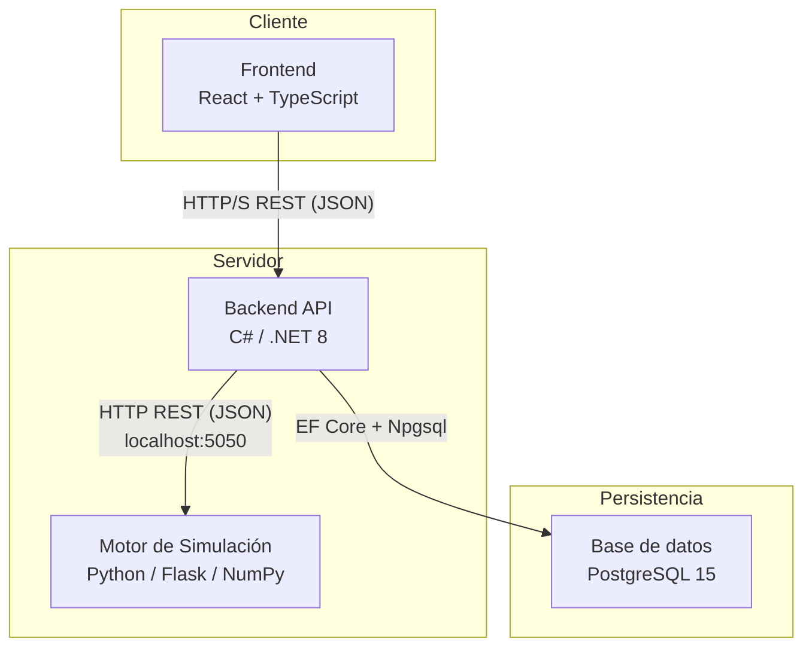

# Simulador de estrategias de inversión

**Proyecto Final — Ingeniería en Informática — FACET — UNT**  
**Autora:** Sofía Rodríguez del Busto  
**Tutor:** Daniel Horacio Melucci

Aplicación web que permite simular y comparar carteras de inversión bajo múltiples escenarios económicos, utilizando el método de Monte Carlo y modelos probabilísticos para cuantificar el impacto del riesgo en la evolución del patrimonio.

---

## Índice

1. [Descripción general](#1-descripción-general)
2. [Arquitectura del sistema](#2-arquitectura-del-sistema)
3. [Stack tecnológico](#3-stack-tecnológico)
4. [Estado de implementación](#4-estado-de-implementación)
5. [Documentación de decisiones de diseño](#5-documentación-de-decisiones-de-diseño)

---

## 1. Descripción general

El simulador permite al usuario:

- Crear portfolios de inversión compuestos por **acciones** (mercado estadounidense), **bonos**, **letras del Tesoro** y **plazos fijos** (mercado argentino).
- Asociar cada portfolio a un **perfil de riesgo** (conservador, moderado o agresivo).
- Ejecutar simulaciones **Monte Carlo estratificadas** por escenario económico (favorable, moderado, desfavorable), generando 1.000 trayectorias posibles del valor del portfolio a lo largo del tiempo.
- Visualizar la evolución del patrimonio y la inflación acumulada por escenario, con métricas de dispersión (p25/mediana/p75) y probabilidad de pérdida nominal y real.
- Consultar simulaciones pasadas sin re-ejecutar el motor, gracias a la persistencia de estadísticas en base de datos.

---

## 2. Arquitectura del sistema

| Componente | Responsabilidad |
|---|---|
| **Frontend** | Presentar la interfaz al usuario: formularios de portfolio, gráficos de trayectorias e inflación, historial de simulaciones. |
| **Backend API** | Gestionar usuarios, portfolios e instrumentos; invocar el motor; persistir resultados en base de datos. |
| **Motor de simulación** | Ejecutar el cálculo numérico: Monte Carlo, GBM para acciones, DCF para bonos, modelos de renta fija indexada. |

El motor corre como microservicio HTTP independiente (`localhost:5050`). Esta separación está justificada por evidencia experimental: Python/NumPy resultó entre **2,4× y 3,4× más rápido** que la implementación equivalente en C# para el rango de portfolios típicos del sistema. El estudio completo se encuentra en [`estudio-pilotos/INFORME_BENCHMARKS.md`](estudio-pilotos/INFORME_BENCHMARKS.md).

---

## 3. Stack tecnológico

| Componente | Tecnología | Justificación |
|---|---|---|
| Frontend | React 18 + TypeScript + Vite | Componentes reutilizables para gráficos; tipado estático para datos financieros; Vite reemplaza CRA discontinuado. |
| Backend API | C# / .NET 8 + ASP.NET Core + EF Core | Plataforma madura para APIs REST; tipado fuerte; ORM con soporte PostgreSQL vía Npgsql. |
| Motor de simulación | Python 3 + Flask + NumPy | Vectorización BLAS/LAPACK; 2,4×–3,4× más rápido que C# medido experimentalmente; Flask agrega overhead mínimo para dos endpoints. |
| Base de datos | PostgreSQL 15 | ACID, soporte JSONB para persistir arrays de estadísticas de largo variable, schema dedicado `simulador_financiero`. |

---

## 4. Estado de implementación

| Componente | Estado | Detalle |
|---|---|---|
| Motor de simulación | Completo | Todos los instrumentos implementados y testeados (64 tests en verde). Endpoint `POST /simular` activo. |
| Esquema de base de datos | Completo | Schema PostgreSQL diseñado y revisado (`db/01_schema.sql`). |
| Backend API | Pendiente | — |
| Frontend | Pendiente | — |

### Instrumentos implementados en el motor

| Instrumento | Modelo | Estocástico |
|---|---|---|
| Plazo fijo tradicional | Capitalización compuesta (TNA mensual) | No |
| Plazo fijo UVA | Capital ajustado por CER + tasa real | Sí (inflación T-2) |
| Letra LECAP | Cupón cero, interés simple | No |
| Letra LECER | Cupón cero + ajuste CER | Sí (inflación T-2) |
| Bono tasa fija | DCF sobre flujos nominales fijos | No |
| Bono indexado CER | DCF real convertido a nominal vía CER | Sí (inflación T-2) |
| Acciones | GBM con correlación de factor único (S&P 500) | Sí |

---

## 5. Documentación de decisiones de diseño

Las decisiones técnicas, matemáticas y de arquitectura tomadas durante el desarrollo se encuentran en la carpeta [`docs/`](docs/):

| Documento | Contenido |
|---|---|
| [docs/01-modelos-financieros.md](docs/01-modelos-financieros.md) | Modelo matemático de cada instrumento, corrección de Itô, rezago T-2 del CER/UVA, suposiciones sobre licitación primaria y flujos del backend. |
| [docs/02-orquestador-montecarlo.md](docs/02-orquestador-montecarlo.md) | Diseño del motor: escenarios, pre-generación de aleatoriedad, modelo de correlaciones, vectorización (5× speedup), separación ARS/USD, estadísticas p25/mediana/p75. |
| [docs/03-base-datos.md](docs/03-base-datos.md) | Decisiones del schema PostgreSQL: tipos de datos, persistencia de estadísticas en JSONB, snapshot de escenarios, restricción de perfiles de riesgo. |
