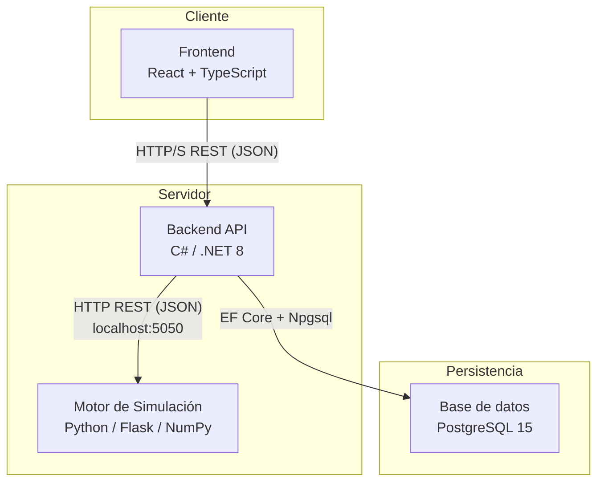

# Simulador de estrategias de inversión basado en perfiles de riesgo y simulación probabilística de instrumentos financieros.

**Proyecto Final — Ingeniería en Informática — FACET — UNT**  
**Autora:** Sofía Rodríguez del Busto  
**Tutor:** Daniel Horacio Melucci

Aplicación web que permite simular y comparar carteras de inversión bajo múltiples escenarios económicos, utilizando el método de Monte Carlo y modelos probabilísticos para cuantificar el impacto del riesgo en la evolución del patrimonio.

---

## Índice

1. [Descripción general](#1-descripción-general)
2. [Arquitectura del sistema](#2-arquitectura-del-sistema)
3. [Stack tecnológico](#3-stack-tecnológico)

---

## 1. Descripción general

El simulador permite al usuario:

- Crear portfolios de inversión compuestos por **acciones** (mercado estadounidense), **bonos**, **letras del Tesoro** y **plazos fijos** (mercado argentino).
- Asociar cada portfolio a un **perfil de riesgo** (conservador, moderado o agresivo).
- Ejecutar simulaciones **Monte Carlo estratificadas** por escenario económico (favorable, moderado, desfavorable), generando miles de trayectorias posibles del valor del portfolio a lo largo del tiempo.
- Consultar métricas de resultado: retorno esperado, rendimiento real, valores extremos y distribución por escenario.
- Reproducir cualquier simulación anterior de forma determinística a partir de la semilla almacenada.

---

## 2. Arquitectura del sistema

### 2.1 Diagrama de componentes

El sistema tiene **tres componentes** con responsabilidades bien separadas:

| Componente | Responsabilidad |
|---|---|
| **Frontend** | Presentar la interfaz al usuario: formularios, gráficos, historial de simulaciones. |
| **Backend API** | Gestionar usuarios, portfolios e instrumentos; orquestar el flujo de simulación; persistir resultados. |
| **Motor de simulación** | Ejecutar el cálculo numérico intensivo (Monte Carlo + GBM + modelos de renta fija). |

> **Por qué tres componentes y no dos.** La separación del motor de simulación en un proceso independiente está justificada por evidencia experimental: el motor en Python/NumPy resultó entre **2,4× y 3,4× más rápido** que la implementación equivalente en C# para el rango de portfolios típicos del sistema. El estudio completo se encuentra en [`estudio-pilotos/INFORME_BENCHMARKS.md`](estudio-pilotos/INFORME_BENCHMARKS.md).

---

## 3. Stack tecnológico

### 3.1 Frontend — React 18 + TypeScript + Vite

| Decisión | Justificación |
|---|---|
| **React** | Librería ampliamente adoptada para interfaces web interactivas. El modelo de componentes se adapta bien a las visualizaciones de portfolios y gráficos de trayectorias. |
| **TypeScript** | Agrega tipado estático sobre JavaScript. Reduce errores en tiempo de desarrollo, especialmente al consumir la API REST donde los tipos de los datos financieros deben ser precisos. |
| **Vite** | Herramienta de build moderna con servidor de desarrollo de arranque instantáneo. Reemplaza a Create React App, que está discontinuado. |

### 3.2 Backend — C# / .NET 8

| Decisión | Justificación |
|---|---|
| **C# / .NET 8** | Plataforma madura para APIs REST. Ofrece tipado fuerte, buen soporte para arquitectura en capas y rendimiento adecuado para la lógica de negocio (validaciones, persistencia, orquestación). |
| **ASP.NET Core** | Framework HTTP oficial de .NET. Permite definir controladores REST, middleware de autenticación y manejo de errores de forma estructurada. |
| **Entity Framework Core + Npgsql** | ORM (Object-Relational Mapper) oficial de .NET con soporte para PostgreSQL mediante el proveedor Npgsql. Permite mapear las entidades del dominio a la base de datos sin escribir SQL directamente en el código de negocio. |

### 3.3 Motor de simulación — Python 3 + Flask + NumPy

| Decisión | Justificación |
|---|---|
| **Python / NumPy** | NumPy ejecuta operaciones vectoriales sobre matrices completas usando rutinas BLAS/LAPACK escritas en C. Esto permite generar las 1.000 trayectorias de Monte Carlo como operaciones matriciales en lugar de bucles, lo que es **2,4×–3,4× más rápido** que la implementación en C# medida experimentalmente. |
| **Flask** | Microframework HTTP minimalista. El motor no necesita un framework complejo: solo exponer dos endpoints (`/simular`, `/ping`). Flask agrega overhead mínimo. |
| **Arquitectura de microservicio HTTP** | La alternativa evaluada fue llamar al script Python como subproceso por cada solicitud. El benchmark demostró que esa estrategia consume **64%–97% del tiempo total solo en arrancar el proceso** Python + NumPy (~100 ms de overhead fijo). Con Flask corriendo de forma persistente, ese overhead se reduce a **~10 ms** de round-trip HTTP. |

### 3.4 Base de datos — PostgreSQL 15

| Decisión | Justificación |
|---|---|
| **PostgreSQL** | Motor de base de datos relacional con soporte ACID y transacciones robustas. |
| **Schema `simulador_financiero`** | Las tablas se crean dentro de un schema separado (`CREATE SCHEMA simulador_financiero`) en lugar de `public`. Esto permite aislar el proyecto de otras bases de datos o aplicaciones en el mismo servidor PostgreSQL. |
