# Manual de usuario — InvestLab

**Simulador de carteras de inversión**
Proyecto Final — Ingeniería en Informática — FACET — UNT
Autora: Sofía Rodríguez del Busto

---

## Índice

1. [Introducción](#1-introducción)
2. [Requisitos y acceso](#2-requisitos-y-acceso)
3. [Primeros pasos](#3-primeros-pasos)
4. [Crear y gestionar un portfolio](#4-crear-y-gestionar-un-portfolio)
5. [Instrumentos disponibles](#5-instrumentos-disponibles)
6. [Ejecutar una simulación](#6-ejecutar-una-simulación)
7. [Interpretar los resultados](#7-interpretar-los-resultados)
8. [Consultar simulaciones pasadas](#8-consultar-simulaciones-pasadas)
9. [Casos especiales y mensajes del sistema](#9-casos-especiales-y-mensajes-del-sistema)
10. [Preguntas frecuentes](#10-preguntas-frecuentes)
11. [Glosario](#11-glosario)

---

## 1. Introducción

InvestLab es una aplicación web que permite **simular y comparar carteras de inversión bajo distintos escenarios económicos**, sin arriesgar capital real. Está pensada para cualquier persona que quiera entender cómo podría evolucionar una cartera de inversión a lo largo del tiempo, comparando decisiones antes de tomarlas con dinero real.

La aplicación permite:

- Armar **portfolios** de inversión combinando acciones (mercado estadounidense), bonos, letras del Tesoro y plazos fijos (mercado argentino).
- Asociar cada portfolio a un **perfil de riesgo**: conservador, moderado o agresivo.
- Ejecutar **simulaciones de Monte Carlo** bajo tres escenarios económicos (favorable, moderado, desfavorable), que generan miles de trayectorias posibles de evolución del patrimonio.
- Visualizar esa evolución con métricas de dispersión (percentiles 25/50/75) y probabilidad de pérdida, tanto en términos nominales como ajustados por inflación.
- Consultar simulaciones anteriores sin necesidad de volver a correrlas.

> Todo lo que se simula en InvestLab es hipotético: no ejecuta ninguna operación real de compra ni venta de instrumentos financieros.

---

## 2. Requisitos y acceso

- Un navegador web actualizado (Chrome, Edge, Firefox).
- Conexión a internet.
- Una cuenta en InvestLab (se crea desde la pantalla de registro).

La aplicación está disponible en producción en:

```
https://proyectofinal-investlab.vercel.app
```

Al ingresar sin una sesión activa, InvestLab pide iniciar sesión o registrarse con email y contraseña. Una vez autenticado, la sesión se mantiene mientras el token siga siendo válido.

### 2.1. Si es la primera vez: crear una cuenta

Si todavía no existe una cuenta, hay que ir a la pestaña **"Crear cuenta"** de la pantalla de acceso y completar el formulario de registro:

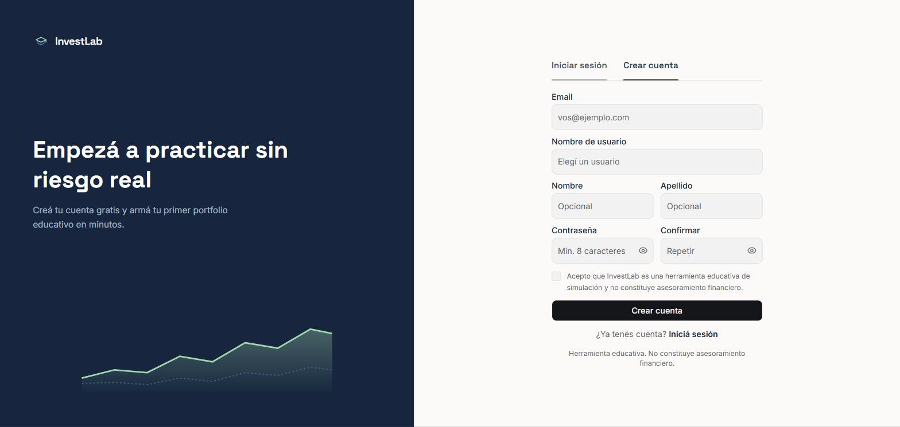

Los datos que pide son:

- **Email**: se usa para iniciar sesión y para recuperar la contraseña si se olvida.
- **Nombre de usuario**: nombre visible dentro de la aplicación.
- **Nombre** y **Apellido** (opcionales).
- **Contraseña** y **Confirmar**: mínimo 8 caracteres. El ícono del ojo permite mostrar u ocultar lo escrito para verificarlo antes de confirmar.
- Un checkbox obligatorio donde se acepta que InvestLab es una herramienta educativa de simulación y no constituye asesoramiento financiero.

Al presionar **"Crear cuenta"**, la cuenta queda creada y la sesión iniciada automáticamente, llevando directo a la pantalla de Inicio (sección 3).

### 2.2. Si ya existe una cuenta: iniciar sesión

Con una cuenta ya creada, alcanza con completar email/usuario y contraseña en la pestaña **"Iniciar sesión"** y confirmar:

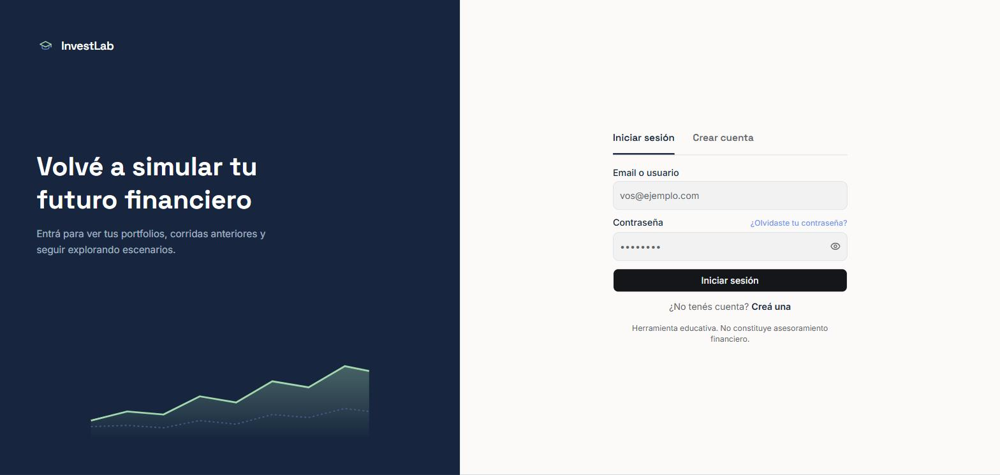

El link "¿Olvidaste tu contraseña?" permite recuperar el acceso si la contraseña se pierde.

---

## 3. Primeros pasos

Al iniciar sesión, la aplicación muestra la pantalla **Inicio**, con tres accesos directos y, si todavía no hay portfolios creados, una invitación a crear el primero.

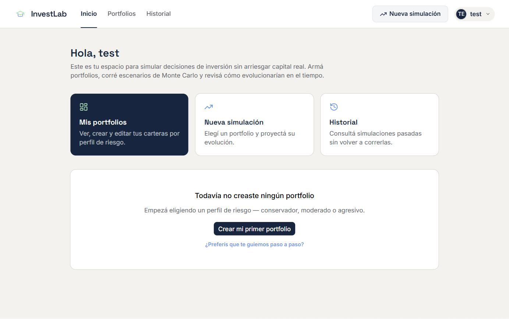

Los tres accesos principales, también disponibles en la barra de navegación superior en todo momento, son:

| Acceso | Qué hace |
|---|---|
| **Mis portfolios** | Ver, crear y editar las carteras, organizadas por perfil de riesgo. |
| **Nueva simulación** | Elegir un portfolio existente y proyectar su evolución. |
| **Historial** | Consultar simulaciones ya ejecutadas, sin volver a correrlas. |

Una vez que existe al menos un portfolio, la pantalla de Inicio lo refleja y ofrece acceso directo a "Ver mis portfolios":

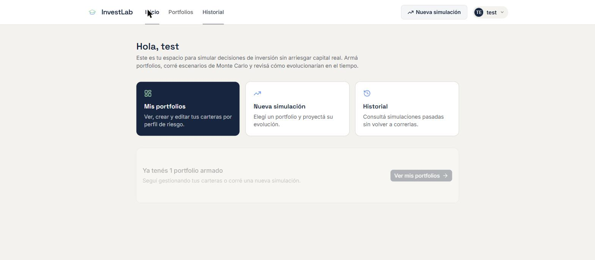

---

## 4. Crear y gestionar un portfolio

### 4.1. Crear un portfolio

Desde "Mis portfolios" (o desde el botón "Crear mi primer portfolio" en el Inicio), se abre un formulario con los datos generales de la cartera:

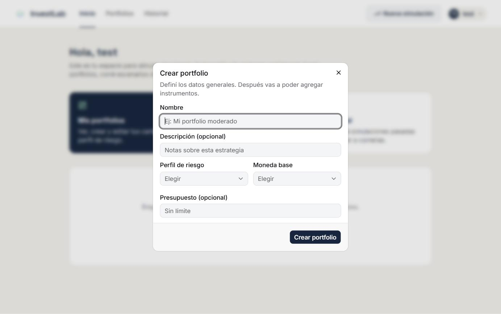

Los campos son:

- **Nombre**: identifica al portfolio. Debe ser único para el mismo usuario dentro del mismo perfil de riesgo (se puede repetir un nombre entre perfiles distintos).
- **Descripción** (opcional): notas libres sobre la estrategia.
- **Perfil de riesgo**: Conservador, Moderado o Agresivo. Condiciona qué tan volátiles pueden ser las acciones que se agreguen después (ver sección 9).
- **Moneda base**: ARS o USD. Es la moneda de referencia para el presupuesto y los totales del portfolio.
- **Presupuesto** (opcional): límite de inversión total. Si se deja vacío, el portfolio queda "sin límite".

Con los datos completos, "Crear portfolio" guarda la cabecera y lleva directamente al detalle del portfolio recién creado:

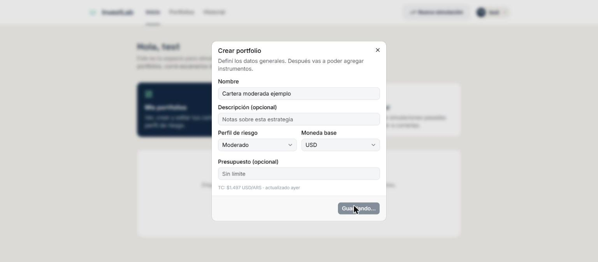

### 4.2. Agregar instrumentos

El detalle del portfolio agrupa los instrumentos por moneda y tipo, en seis secciones: Acciones y Plazo fijo (USD), y Bonos, Letras y Plazo fijo (ARS).

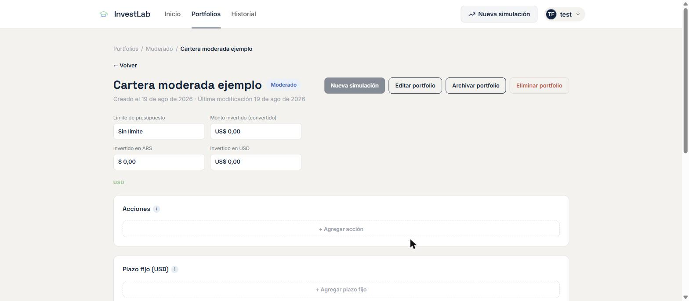

Para agregar un instrumento se despliega el bloque correspondiente ("+ Agregar acción", "+ Agregar bono", etc.) y se elige el instrumento del catálogo:

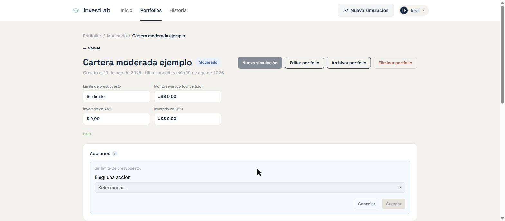

Al elegir un instrumento, InvestLab autocompleta sus datos de mercado (sector, precio actual y, para acciones, retorno esperado, volatilidad y correlación con su índice de referencia — ver el glosario para qué significa cada uno):

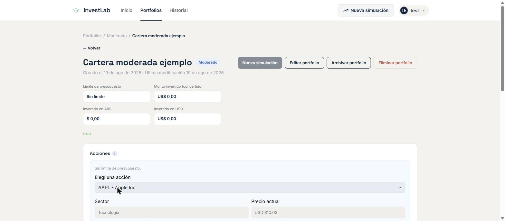

Lo único que hay que ingresar manualmente es la **cantidad**. El formulario calcula en el momento el monto invertido:

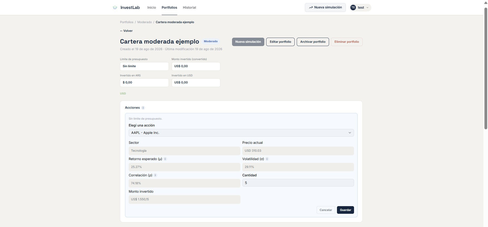

Al guardar, el instrumento queda listado en su sección, y el portfolio actualiza el monto total invertido:

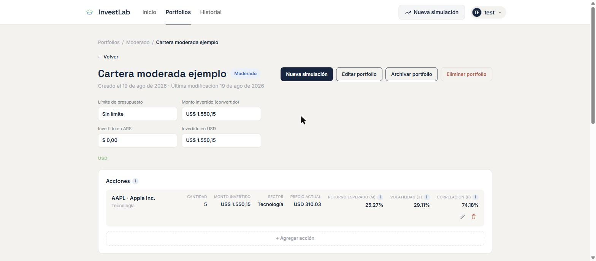

Cada instrumento se puede editar o eliminar en cualquier momento desde su fila, salvo que el portfolio esté archivado (ver sección 9).

### 4.3. Reglas a tener en cuenta

- No se puede cargar dos veces el mismo instrumento de catálogo (misma acción, bono o letra) en un portfolio: hay que aumentar la cantidad de la fila existente en su lugar. Los plazos fijos son la excepción, porque cada uno es un contrato independiente y se pueden cargar varios, incluso del mismo banco.
- Si el presupuesto tiene un límite, InvestLab impide superar ese monto al cargar nuevos instrumentos.
- El tipo de cambio usado para convertir montos entre ARS y USD se actualiza una vez por día; junto al presupuesto se muestra cuándo fue la última actualización (por ejemplo, "TC: $1.497 USD/ARS · actualizado ayer").

---

## 5. Instrumentos disponibles

InvestLab modela siete instrumentos, cuatro de ellos ajustados por inflación y tres no. En todos los casos, el usuario no necesita conocer las fórmulas: alcanza con entender qué representa cada uno.

| Instrumento | Mercado | ¿Se ajusta por inflación? | Descripción |
|---|---|---|---|
| **Acciones** | EE. UU. (USD) | No directamente — su precio es volátil por naturaleza | Participación en una empresa. Su evolución se simula con un modelo de comportamiento aleatorio (GBM) correlacionado con el S&P 500: cuanto más correlacionada esté una acción con el índice, más tiende a moverse junto con el mercado en general. |
| **Bono tasa fija** | Argentina (ARS) | No | Título de deuda que paga flujos de dinero fijos, ya pactados, en fechas determinadas. |
| **Bono indexado CER** | Argentina (ARS) | Sí | Igual que el anterior, pero sus flujos se ajustan por inflación (CER), con un rezago real de unos dos meses entre la inflación del mes y su reflejo en el instrumento. |
| **Letra LECAP** | Argentina (ARS) | No | Título de corto plazo que se compra con descuento y paga un valor fijo al vencimiento (interés simple, "cupón cero"). |
| **Letra LECER** | Argentina (ARS) | Sí | Igual que la LECAP, pero el valor al vencimiento se ajusta por inflación (CER). |
| **Plazo fijo tradicional** | Argentina (ARS o USD) | No | Depósito a un banco a una tasa nominal anual (TNA) pactada. El capital crece con interés compuesto mes a mes. |
| **Plazo fijo UVA** | Argentina (ARS) | Sí | Depósito cuyo capital se ajusta por inflación (UVA) y sobre ese capital ya ajustado se paga además una tasa real. |

Puntos a tener en cuenta:

- El vencimiento de un bono o una letra es independiente del horizonte que se elija para la simulación: si el instrumento vence después del horizonte simulado, InvestLab corta la proyección en el horizonte elegido, sin extenderla hasta el vencimiento real.
- Los instrumentos indexados por inflación (bono CER, letra LECER, plazo fijo UVA) reflejan la inflación con un rezago real de aproximadamente dos meses, tal como ocurre con el CER/UVA en la práctica: no es un error de la simulación, es cómo funciona el instrumento real.
- No existe una versión "UVA" en dólares: el plazo fijo en USD siempre es a tasa fija.

---

## 6. Ejecutar una simulación

Una simulación se puede iniciar de dos formas: desde el botón **"Nueva simulación"** de la barra superior (que primero pide elegir el portfolio)...

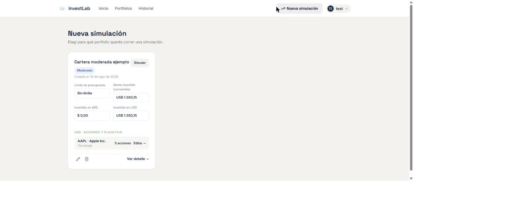

...o directamente desde el detalle de un portfolio, con el botón "Nueva simulación" de esa pantalla, que salta directamente al paso siguiente: definir el horizonte temporal.

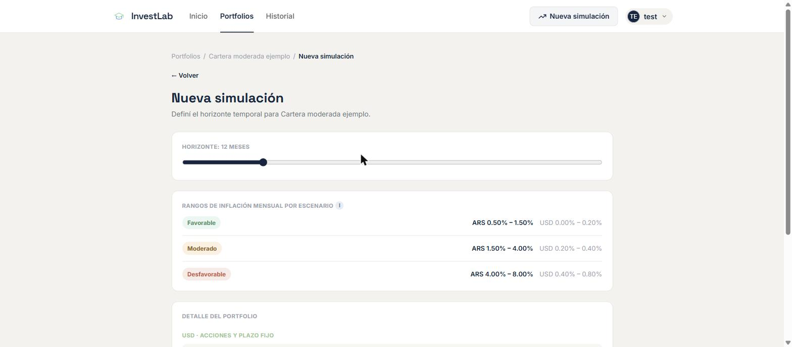

En esta pantalla se define:

- **Horizonte**: cuántos meses hacia adelante se quiere proyectar el portfolio (deslizador, de 1 a 60 meses según la configuración vigente).
- **Rangos de inflación mensual por escenario**: InvestLab no le pide al usuario que estime la inflación futura; en cambio, sortea un valor dentro de un rango típico para cada uno de los tres escenarios (favorable, moderado, desfavorable), tanto en ARS como en USD.

Más abajo, la pantalla muestra el detalle del portfolio a simular y el botón para lanzar la corrida:

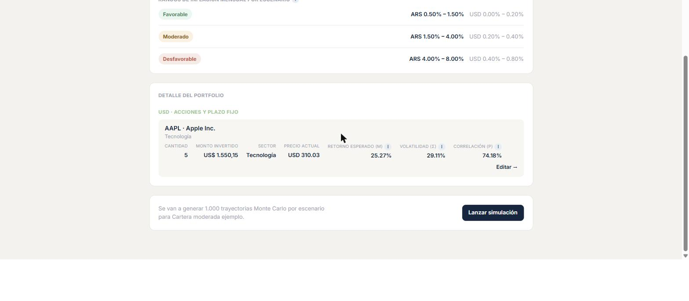

Al presionar **"Lanzar simulación"**, el motor genera miles de trayectorias posibles (1.000 por escenario, 3.000 en total) para ese portfolio y ese horizonte:

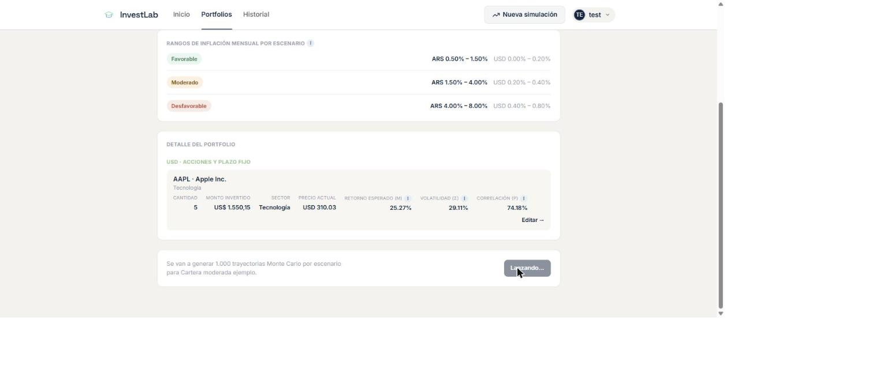

El proceso tarda unos segundos. Al finalizar, InvestLab confirma cuántas trayectorias se corrieron y ofrece ir directamente a los resultados:

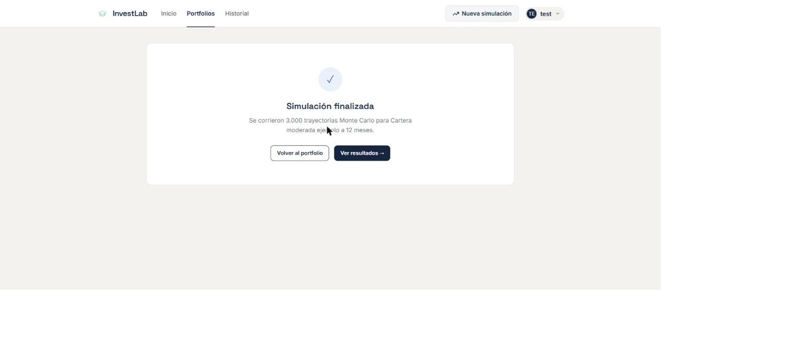

> Si el portfolio tiene datos de mercado desactualizados respecto al catálogo (por ejemplo, cambió el precio o la tasa de referencia de algún instrumento desde que se cargó), InvestLab lo avisa con un banner y ofrece ir a una pantalla de comparación antes de simular, donde se puede optar por mantener los valores originales o actualizarlos. Ver sección 9.

---

## 7. Interpretar los resultados

La pantalla de resultados es la más importante del simulador: es donde se traduce la corrida de Monte Carlo en información útil para decidir.

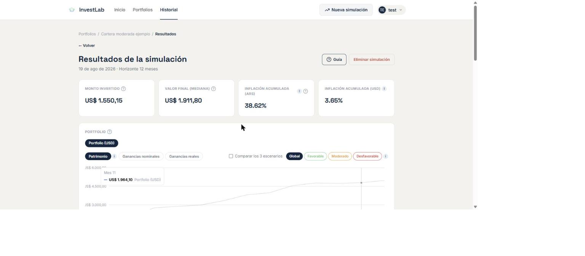

En la parte superior aparecen cuatro indicadores clave:

- **Monto invertido**: lo que efectivamente se puso en el portfolio.
- **Valor final (mediana)**: el valor del portfolio al final del horizonte simulado, en la trayectoria "del medio" — la mitad de las 3.000 trayectorias terminaron por encima de ese valor, y la otra mitad por debajo.
- **Inflación acumulada (ARS)** e **Inflación acumulada (USD)**: cuánto se estima que subieron los precios en cada moneda durante el horizonte simulado, en el escenario elegido.

Debajo, el gráfico principal muestra la evolución del **patrimonio** mes a mes, con tres capas de información: la línea central (la trayectoria mediana), una banda sombreada (el rango entre percentil 25 y percentil 75, es decir, dónde cayó el 50% central de las simulaciones) y las líneas finas de mínimo y máximo simulado. Arriba del gráfico se puede alternar entre ver el **patrimonio**, las **ganancias nominales** o las **ganancias reales** (ya descontada la inflación), y también comparar los tres escenarios económicos en simultáneo con el checkbox "Comparar los 3 escenarios".

El mismo tipo de gráfico está disponible por instrumento individual, para ver cómo contribuyó cada uno a la cartera:

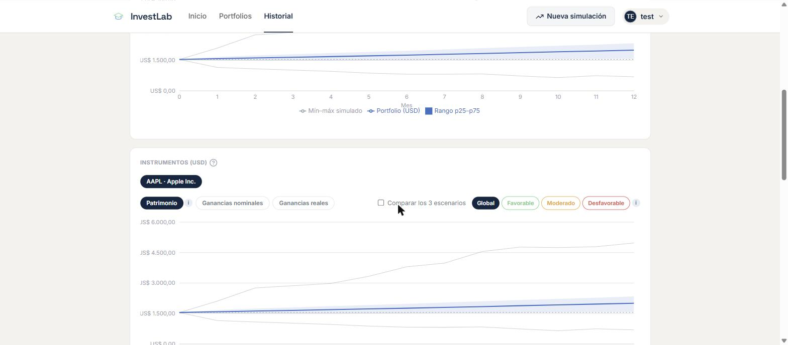

Más abajo, la tabla de **percentiles al final del horizonte** resume la dispersión de resultados en tres puntos:

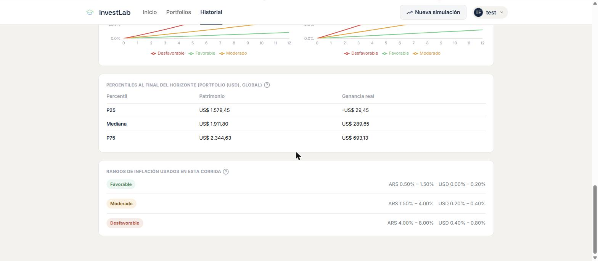

| Percentil | Qué significa |
|---|---|
| **P25** | Un escenario relativamente desfavorable dentro de lo simulado: el 25% de las trayectorias terminó en un valor igual o menor a este. |
| **Mediana** | El resultado "típico": la mitad de las trayectorias terminó por encima, la mitad por debajo. |
| **P75** | Un escenario relativamente favorable: el 25% de las trayectorias terminó en un valor igual o mayor a este. |

La columna "Ganancia real" ya descuenta la inflación de cada trayectoria, por lo que puede ser negativa (pérdida de poder adquisitivo) incluso cuando el patrimonio nominal creció.

Por último, la sección de **inflación por escenario** muestra, para cada uno de los tres escenarios, la inflación mensual y acumulada que efectivamente se usó en esa corrida:

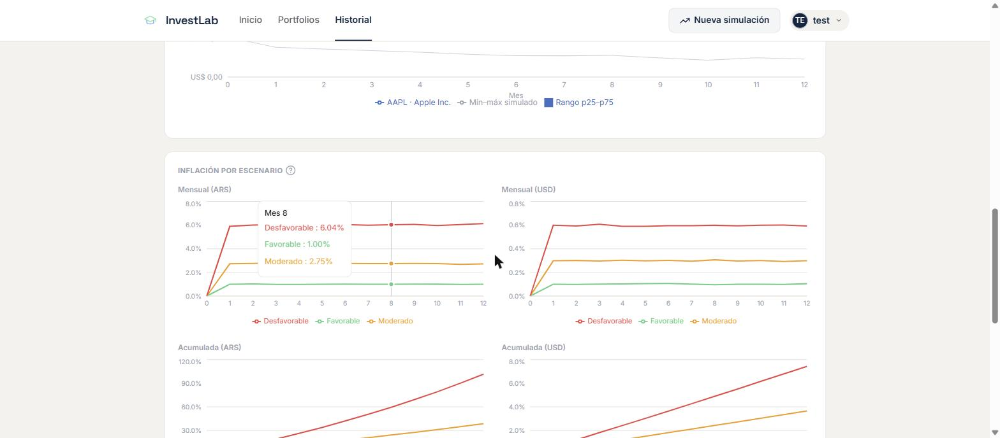

> **Cómo leer todo esto en conjunto:** cuanto más ancha es la banda entre P25 y P75, más incierto es el resultado — no necesariamente peor, sino más disperso. Un portfolio con perfil agresivo típicamente muestra una banda más ancha que uno conservador, para el mismo horizonte.

---

## 8. Consultar simulaciones pasadas

La sección **Historial** lista todas las corridas hechas hasta el momento, más recientes primero, con filtros por perfil de riesgo:

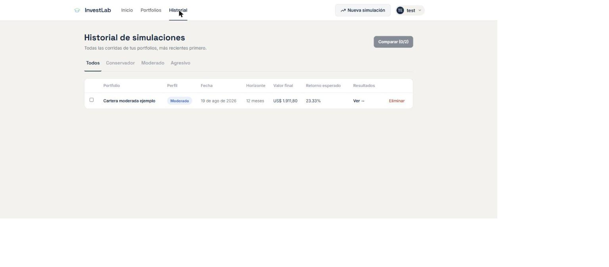

Desde ahí se puede volver a ver el detalle de resultados de cualquier corrida ("Ver") sin necesidad de ejecutarla de nuevo — cada simulación queda guardada como una foto de ese momento (con qué composición de portfolio y qué inflación se corrió), aunque el portfolio haya cambiado después.

La vista de "Mis portfolios" complementa al Historial: agrupa las carteras por perfil de riesgo y permite lanzar una nueva simulación directamente desde cada tarjeta.

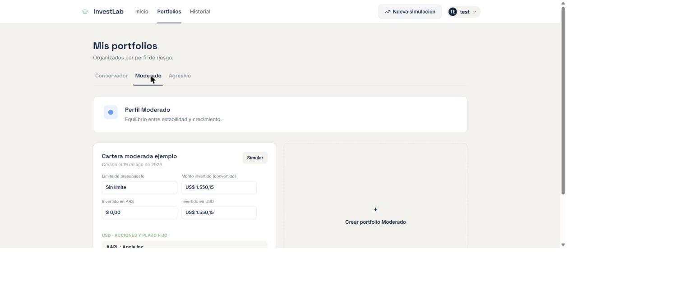

### 8.1. Comparar dos simulaciones

Desde el Historial se puede tildar el checkbox de hasta dos corridas — del mismo portfolio o de portfolios distintos, incluso de perfiles de riesgo diferentes — y presionar **"Comparar (2/2)"**:

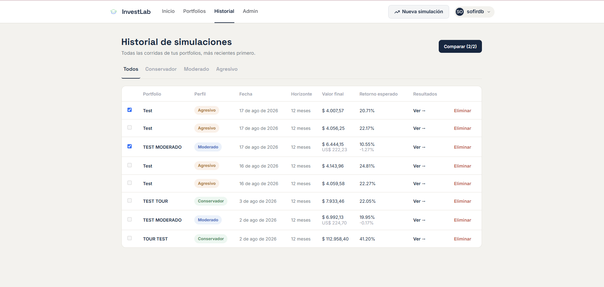

Se carga la pantalla "Comparar simulaciones":

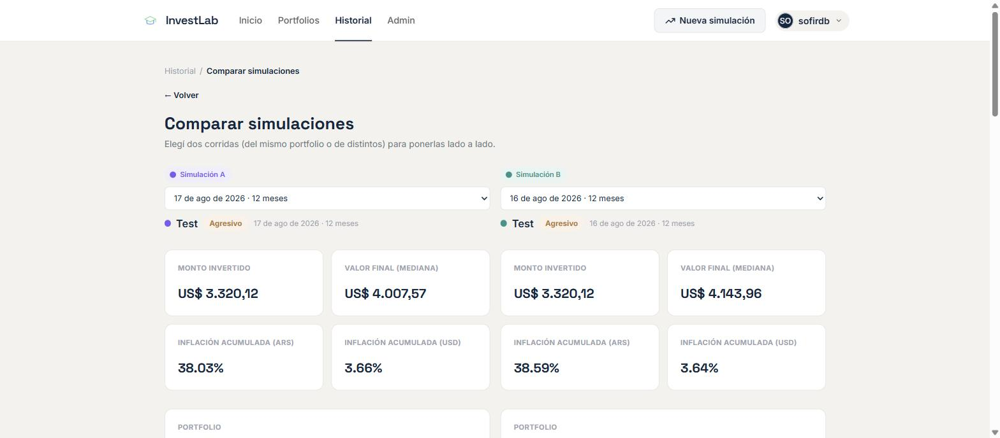

Arriba se puede cambiar cuál corrida ocupa cada lado (los desplegables "Simulación A" / "Simulación B") y se repiten, una al lado de la otra, las mismas métricas clave de la sección 7: monto invertido, valor final (mediana) e inflación acumulada en ARS y en USD.

Más abajo, los mismos gráficos de evolución del patrimonio se muestran en paralelo para cada simulación, con los controles habituales de patrimonio/ganancias nominales/ganancias reales y de escenario:

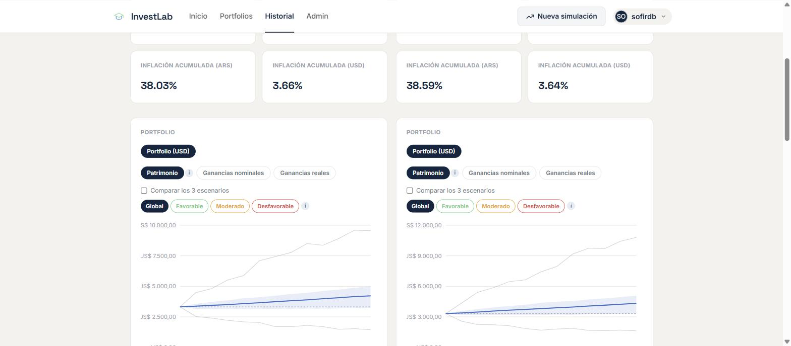

Y, al igual que en la pantalla de resultados individual, también se puede bajar un nivel y comparar la evolución de un instrumento puntual entre ambas corridas:

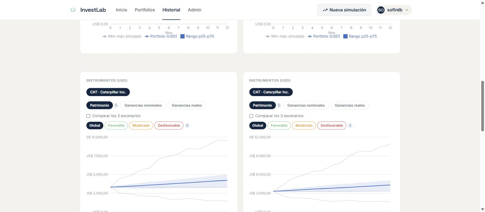

Esta vista es útil para responder preguntas concretas como "¿esta cartera rindió mejor con el perfil agresivo que con el moderado?" o "¿cambió mucho el resultado entre estas dos corridas del mismo portfolio?", sin tener que ir y volver entre dos pantallas de resultados por separado.

---

## 9. Casos especiales y mensajes del sistema

**Instrumento vencido que bloquea la simulación.** Si algún instrumento del portfolio ya venció (una letra o un bono sin flujos pendientes, o un plazo fijo cuyo plazo terminó sin reinversión automática), InvestLab no permite lanzar la simulación y explica cuál es el instrumento problemático. La solución está siempre en el detalle del portfolio, no en la pantalla de simulación.

**Plazo fijo vencido: eliminar o renovar.** En particular, un plazo fijo vencido se marca con una etiqueta "Vencido" en su fila, dentro del detalle del portfolio, y ofrece un botón "Renovar" que muestra el desglose (capital pactado + interés ya devengado = nuevo capital renovado) antes de confirmar. También se puede eliminar la fila directamente. Si el plazo fijo tiene activada la reinversión automática, nunca llega a vencer para la simulación: se trata como crecimiento compuesto continuo.

**Datos de mercado desactualizados.** Si el precio, la tasa o los parámetros de alguna acción, bono o letra cambiaron en el catálogo desde que se cargaron en el portfolio, InvestLab lo avisa antes de simular con un banner "Ver comparación", que lleva a una pantalla (Vista Comparativa) donde se puede elegir, para todo el portfolio en conjunto: mantener los valores originales, actualizarlos sin simular todavía, o actualizarlos y continuar directo a simular.

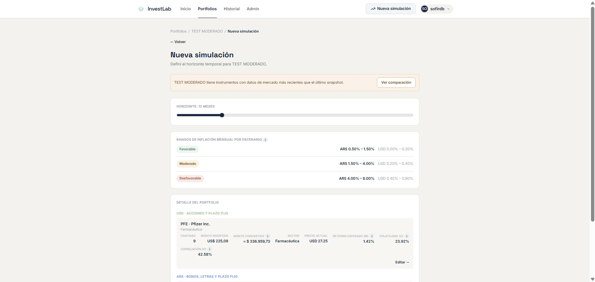

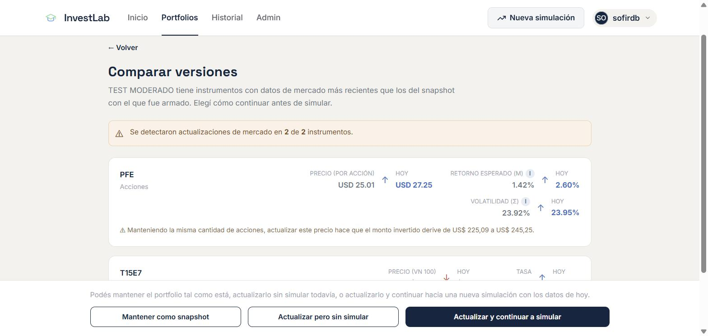

En el ejemplo, InvestLab detectó que 2 de los 2 instrumentos del portfolio (una acción y un bono) tienen precio y tasa más recientes en el catálogo que los que se usaron al armar la cartera, y muestra para cada uno el valor original junto al valor de hoy, además de cómo cambiaría el monto invertido si se actualiza. Al pie de la pantalla están las tres acciones posibles:

| Acción | Qué hace |
|---|---|
| **Mantener como snapshot** | No cambia nada; vuelve a "Nueva simulación" con los valores originales. |
| **Actualizar pero sin simular** | Actualiza precio y tasa/GBM de todo el portfolio y vuelve a su detalle, sin lanzar ninguna corrida todavía. |
| **Actualizar y continuar a simular** | Actualiza el portfolio y vuelve a "Nueva simulación", ya sin el banner, lista para elegir horizonte y lanzar. |

**Volatilidad de una acción por encima del perfil de riesgo.** Cada perfil de riesgo tiene un límite de volatilidad mensual permitida para las acciones (el perfil conservador es el más estricto; el agresivo no tiene límite). Si se intenta agregar una acción que supera el límite del perfil actual del portfolio, o si se intenta cambiar el perfil de riesgo de un portfolio que ya tiene acciones incompatibles con el nuevo límite, InvestLab rechaza la operación y no aplica el cambio.

**Portfolio archivado.** Un portfolio archivado queda en modo solo lectura: se puede seguir consultando su detalle e historial de simulaciones, pero no se pueden agregar, editar ni eliminar instrumentos hasta reactivarlo.

**Nombres de portfolio repetidos.** InvestLab no permite crear dos portfolios con el mismo nombre para el mismo perfil de riesgo del mismo usuario. El mismo nombre sí se puede reutilizar en un perfil de riesgo distinto.

---

## 10. Preguntas frecuentes

**¿Simular una cartera mueve dinero real?**
No. InvestLab es enteramente una herramienta de simulación educativa; no ejecuta compras, ventas ni transferencias reales.

**¿Por qué dos simulaciones del mismo portfolio, con el mismo horizonte, dan resultados distintos?**
Porque cada corrida sortea nuevas trayectorias e inflación al azar (dentro de los rangos de cada escenario). Es el comportamiento esperado de un método de Monte Carlo: cada corrida es una muestra distinta de futuros posibles, no una única predicción.

**¿Qué pasa si cambio los instrumentos del portfolio después de simular?**
La simulación ya ejecutada no cambia: queda guardada como una foto de ese momento. Para ver el efecto del cambio hay que correr una simulación nueva.

**¿Puedo comparar portfolios de perfiles de riesgo distintos?**
Sí. La comparación de simulaciones no está limitada a portfolios del mismo perfil; se puede, por ejemplo, contrastar un portfolio conservador contra uno agresivo con montos similares.

**¿Con qué frecuencia se actualizan los precios y tasas del catálogo?**
Depende del instrumento; en general se sincronizan mediante procesos administrativos periódicos. El tipo de cambio USD/ARS se actualiza como máximo una vez por día, y su antigüedad se muestra siempre junto al valor.

---

## 11. Glosario

**Simulación de Monte Carlo**: técnica que, en vez de calcular un único resultado futuro, genera un gran número de trayectorias posibles (en InvestLab, miles) sorteando al azar variables inciertas dentro de rangos razonables, para después observar la distribución completa de resultados.

**Escenario económico**: uno de los tres contextos macroeconómicos que InvestLab simula (favorable, moderado, desfavorable), cada uno con su propio rango de inflación esperada.

**Percentil (P25, P75)**: valor por debajo del cual cae un determinado porcentaje de las trayectorias simuladas. El percentil 25 (P25) es un resultado relativamente bajo dentro de lo simulado; el percentil 75 (P75), uno relativamente alto.

**Mediana**: el valor central de todas las trayectorias simuladas — el percentil 50.

**Retorno esperado (μ)**: tendencia de retorno mensual observada históricamente para un instrumento; hacia dónde tendió a moverse su precio en el pasado.

**Volatilidad (σ)**: cuánto tendió a oscilar el precio de un instrumento históricamente. A mayor volatilidad, mayor el rango de resultados posibles en la simulación.

**Correlación (ρ)**: qué tan de la mano se movió un instrumento con su índice de referencia (por ejemplo, el S&P 500 para acciones) en el pasado.

**CER (Coeficiente de Estabilización de Referencia) / UVA (Unidad de Valor Adquisitivo)**: mecanismos oficiales argentinos que ajustan el valor de un instrumento según la inflación medida por el INDEC, con un rezago real de aproximadamente dos meses entre la inflación de un mes y su reflejo en el coeficiente.

**Ganancia nominal**: diferencia entre el valor final y el monto invertido, sin ajustar por inflación.

**Ganancia real**: la misma diferencia, pero ajustada por la inflación acumulada de esa trayectoria — refleja el cambio real en el poder adquisitivo.

**Perfil de riesgo**: clasificación de un portfolio (conservador, moderado o agresivo) que determina, entre otras cosas, cuánta volatilidad máxima puede tener una acción para poder agregarse a ese portfolio.

**Horizonte de simulación**: cantidad de meses hacia adelante que se proyecta un portfolio en una corrida determinada. Es un parámetro de cada simulación, no del portfolio: el mismo portfolio se puede simular con distintos horizontes en distintas corridas.
